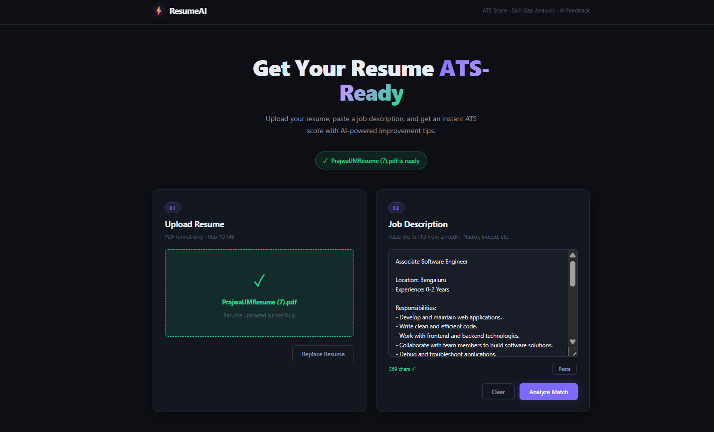
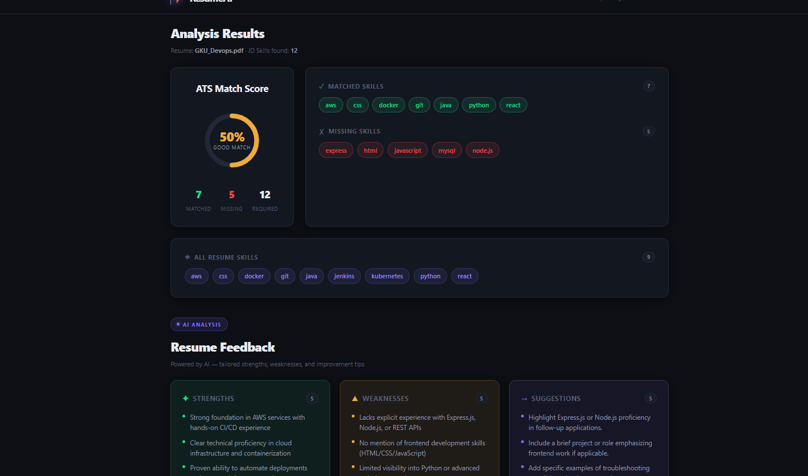
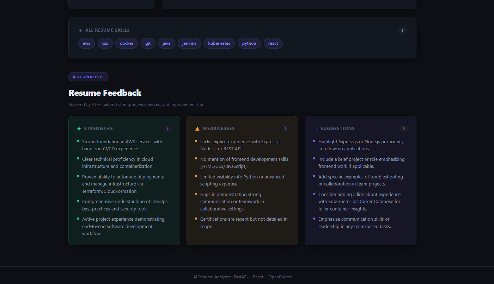

# ⚡ AI Resume Analyzer

A **full-stack ATS resume analyzer** built with **FastAPI + React + OpenRouter AI**. Upload your PDF resume, paste a job description, and get an instant ATS match score — plus AI-powered pros, cons, and improvement suggestions.

<div align="center">
  
  <br/><br/>
  
  <br/><br/>
  
</div>

---

## ✨ Features

- 📤 **Resume Upload** — drag-and-drop PDF upload with live validation
- 📋 **JD Paste** — paste any job description (LinkedIn, Naukri, Indeed, etc.)
- 📊 **ATS Match Score** — deterministic scoring algorithm (0–100) with animated SVG ring
- ✅ **Matched Skills** — skills found in both resume and JD
- ❌ **Missing Skills** — skills required by JD but absent from resume
- 🏷️ **Skill Categorization** — Programming, Frontend, Backend, Database, DevOps, Cloud, AI/ML
- 🤖 **AI Feedback** — OpenRouter-powered strengths, weaknesses, and actionable suggestions
- 🔄 **8-Model Fallback** — automatically tries alternative free models if one is rate-limited
- 🌙 **Dark Theme UI** — premium dark design with glassmorphism and micro-animations
- 📱 **Responsive Design** — works on all screen sizes

---

## 🗂️ Project Structure

```
ai-resume-analyzer/
│
├── backend/
│   ├── main.py                    # FastAPI app — all routes, CORS, dotenv
│   ├── .env                       # API keys (gitignored — create from .env.example)
│   ├── .env.example               # Template for environment variables
│   │
│   ├── services/
│   │   └── ai_service.py          # OpenRouter AI integration + 8-model fallback
│   │
│   ├── parsers/
│   │   ├── resume_parser.py       # PDF text extraction (pdfplumber)
│   │   ├── jd_parser.py           # JD PDF text extraction
│   │   ├── section_parser.py      # Resume section detection
│   │   └── info_parser.py         # Name / email / phone extraction
│   │
│   └── analyzers/
│       ├── skill_extractor.py     # Skill detection & categorization
│       ├── resume_analyzer.py     # Resume completeness scoring
│       ├── jd_skill_extractor.py  # JD skill extraction
│       └── jd_matcher.py          # Resume vs JD matching + ATS score
│
├── frontend/
│   ├── src/
│   │   ├── App.jsx                # Root component + AI feedback orchestration
│   │   ├── App.css                # Full design system (dark theme)
│   │   ├── api/
│   │   │   └── api.js             # Axios client (proxied via Vite)
│   │   └── components/
│   │       ├── ResumeUpload.jsx   # Drag-drop upload → POST /upload-resume
│   │       ├── JDInput.jsx        # JD textarea → POST /match-jd
│   │       ├── ResultsPanel.jsx   # ATS score ring + skill pills
│   │       └── AIFeedback.jsx     # AI pros/cons/suggestions + skeleton loader
│   ├── vite.config.js             # Vite dev proxy → FastAPI backend
│   └── package.json
│
├── requirements.txt
├── .gitignore
└── README.md
```

---

## 🚀 Getting Started

### Prerequisites
- Python 3.9+
- Node.js 18+
- [OpenRouter API key](https://openrouter.ai/keys) (free)

---

### 1. Clone the repo

```bash
git clone https://github.com/prajwaljm123/ai-resume-analyzer.git
cd ai-resume-analyzer
```

---

### 2. Backend Setup

```bash
cd backend

# Create & activate virtual environment
python -m venv venv
venv\Scripts\activate        # Windows
# source venv/bin/activate   # macOS / Linux

# Install Python dependencies
pip install -r requirements.txt

# Set up environment variables
cp .env.example .env
# Edit .env and add your OpenRouter API key:
# OPENROUTER_API_KEY=sk-or-v1-your-key-here

# Start the backend
uvicorn main:app --reload
```

- API: **http://127.0.0.1:8000**
- Swagger Docs: **http://127.0.0.1:8000/docs**

---

### 3. Frontend Setup

```bash
# In a new terminal, from the project root:
cd frontend

npm install
npm run dev
```

- App: **http://localhost:5173**

> The Vite dev server proxies all `/api/*` requests to `http://127.0.0.1:8000` — no CORS issues in development.

---

## 📡 API Endpoints

| Method | Endpoint | Description |
|--------|----------|-------------|
| `GET`  | `/` | Health check |
| `POST` | `/upload-resume` | Upload a PDF resume |
| `GET`  | `/extract-text` | Extract raw text from uploaded resume |
| `GET`  | `/parse-info` | Extract name, email, phone |
| `GET`  | `/parse-sections` | Detect resume sections |
| `GET`  | `/extract-skills` | Extract categorized skills |
| `GET`  | `/resume-summary` | Full summary (contact + sections + skills) |
| `GET`  | `/analyze-resume` | Full analysis with resume score |
| `POST` | `/upload-jd` | Upload a PDF job description |
| `POST` | `/match-jd` | Match resume vs JD text → ATS score |
| `POST` | `/match-jd-pdf` | Match resume vs JD PDF → ATS score |
| `POST` | `/generate-feedback` | AI pros/cons/suggestions via OpenRouter |

---

## 🛠️ Tech Stack

| Layer | Technology |
|---|---|
| Backend Framework | FastAPI |
| Server | Uvicorn |
| PDF Parsing | pdfplumber |
| AI Integration | OpenRouter (8 free models in fallback chain) |
| Env Management | python-dotenv |
| Language | Python 3.9+ |
| Frontend Framework | React 19 + Vite |
| HTTP Client | Axios |
| Styling | Vanilla CSS (dark design system) |
| Dev Proxy | Vite server proxy |

---

## 🔄 How It Works

```
1. User uploads PDF resume  →  POST /upload-resume  →  saved to backend/uploads/
2. User pastes job description text
3. POST /match-jd  →  extracts JD skills  →  matches with resume skills
4. ATS Score calculated (deterministic, no AI):
      - Skill match %          → up to 60 pts
      - Category coverage      → up to 20 pts
      - Core skill presence    → up to 10 pts
      - Missing skill penalty  → up to -10 pts
5. Results displayed instantly (score ring + matched/missing pills)
6. POST /generate-feedback  →  OpenRouter AI (non-blocking)
      - Tries 8 free models in order, skips rate-limited ones
      - Returns: strengths (pros), weaknesses (cons), suggestions
7. AI feedback section fades in below results
```

---

## 🤖 AI Feedback — Model Fallback Chain

The app tries these free OpenRouter models in order. If one is rate-limited, it automatically moves to the next:

1. `google/gemma-4-26b-a4b-it:free`
2. `liquid/lfm-2.5-1.2b-instruct:free`
3. `google/gemma-4-31b-it:free`
4. `nousresearch/hermes-3-llama-3.1-405b:free`
5. `meta-llama/llama-3.3-70b-instruct:free`
6. `cognitivecomputations/dolphin-mistral-24b-venice-edition:free`
7. `qwen/qwen3-next-80b-a3b-instruct:free`
8. `meta-llama/llama-3.2-3b-instruct:free`

> If all models are rate-limited, the app still works — ATS scoring and skill matching are unaffected. The AI section shows default improvement tips as fallback.

---

## 🔐 Environment Variables

Create `backend/.env` from the template:

```bash
cp backend/.env.example backend/.env
```

| Variable | Description |
|---|---|
| `OPENROUTER_API_KEY` | Your free API key from [openrouter.ai/keys](https://openrouter.ai/keys) |

---

## 📄 License

MIT
